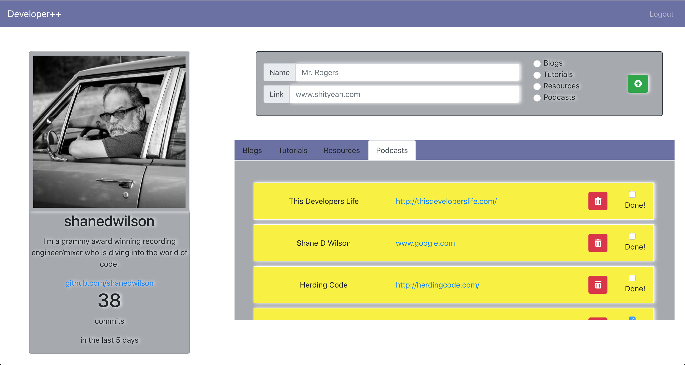
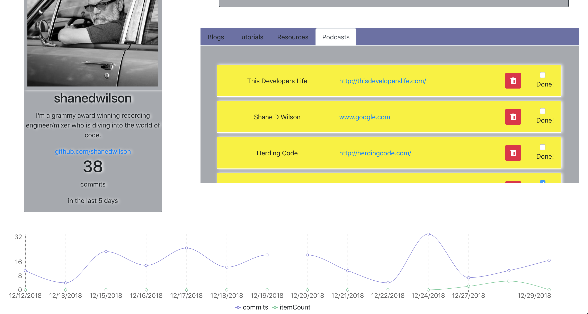

### Developer++
This app is the first assignment given to us to complete in React. It includes a GitHub Calling Card and the ability to store and delete our developing resources. We also have the ability to mark the resources as completed. A stretch goal was to use Rechart to graph our GitHub commits and our completed resources. Much thanks to my friend and collegue, Marco Crank, for leading the way on finding the charting path.

## Tech Requirements
* Use create-react-app to start a new react project
* Use GITHUB authentication
* Include a navbar
* Use CRUD to easily add learning materials to the project
* Use radio buttons to categorize a material as a tutorial, blog, documentation, or podcast via CRUD
* Use a checkbox to mark resources as completed, via CRUD. When a resource is marked as completed it should show up at the bottom of the tab it belongs to.
* The ability to delete resources via CRUD.

## Screenshots



## How to run this project:

* Setup Firebase
    Create a firebase project
    Enable 'Github Authentication'
    Create a Firebase Realtime Database (Not Firestore)
    Create an apiKeys.js file (an example file exists in the 'helpers' folder)

* Clone or download the repo

* Browse to the repo directory in your terminal

* ```npm install`` installs necessary dependencies

* ```npm start``` will run the project at http://localhost:3000
